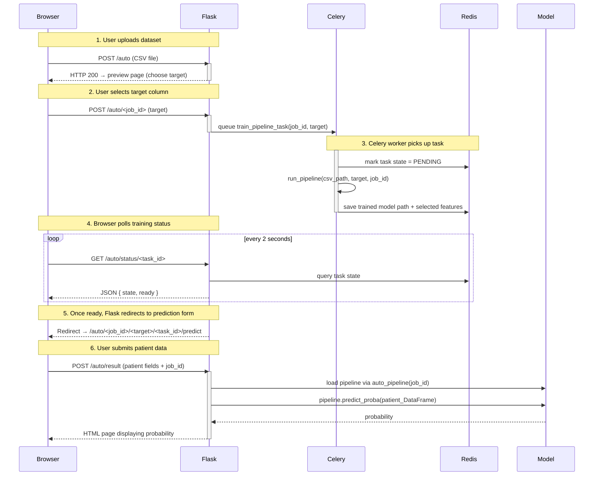
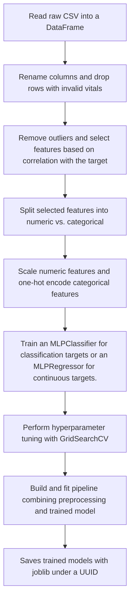

# Model integration with Flask
## Base Blueprint (`/`)
| Method | Path | Description |
|--------|------|-------------|
| `GET`  | `/`  | Landing page – choose **AutoML** or **Custom** mode. |
| `POST` | `/`  | Form action from the buttons above. |

## Custom Blueprint (`/cardio…`)
| Method | Path | Description |
|--------|------|-------------|
| `GET`  | `/cardio` | Static form that feeds the *pre-trained* model. |
| `POST` | `/cardio_predict`| Returns CVD probability. |

## Auto Blueprint (`/auto…`)
| Method | Path | Description |
|--------|------|-------------|
| `GET`  | `/auto` | Upload UI for a CSV dataset. |
| `POST` | `/auto/upload` | Saves CSV under a UUID and redirects to preview. |
| `GET`  | `/auto/<job_id>` | DataFrame preview; pick target column. |
| `POST` | `/auto/<job_id>` | Queues training task and shows loading page. |
| `GET`  | `/auto/status/<task_id>` | JSON `{state, ready}` – polled by JS. |
| `GET`  | `/auto/<job_id>/<target>/<task_id>/predict` | Auto-generated form for the selected features. |
| `POST` | `/auto/result` | Renders probability from the freshly trained model. |
## Request → Prediction Flow

Below is an improved sequence diagram that clearly shows each step from uploading a CSV to receiving a prediction. It groups component interactions and labels each arrow more consistently.

## Summary of the Workflow
1. **Flask (Web Server)**  
   - Receives user requests (e.g., file upload, form submission).  
   - Enqueues long-running tasks in Celery via RabbitMQ.  
   - Polls Redis for task status and retrieves results.  
   - Renders HTML pages and returns responses to the browser.

2. **RabbitMQ (Broker)**  
   - Acts as a FIFO queue for Celery tasks.  
   - Buffers tasks when workers are busy.  
   - Ensures reliable delivery of each training job message to a Celery worker.

3. **Celery (Worker Manager)**  
   - Consumes tasks from RabbitMQ.  
   - Executes Python functions asynchronously (`train_pipeline_task`, etc.).  
   - Pushes results and task state updates into Redis.

4. **Redis (Result Backend)**  
   - Stores each task’s current state (`PENDING`, `STARTED`, `SUCCESS`, `FAILURE`).  
   - Keeps the return value (e.g., model path and selected features) for Flask to fetch.  
---
# Full scikit-learn pipeline
### **Dataset to use: [cardio_train.csv](../data/cardio_train.csv)**

## Full scikit-learn pipeline

